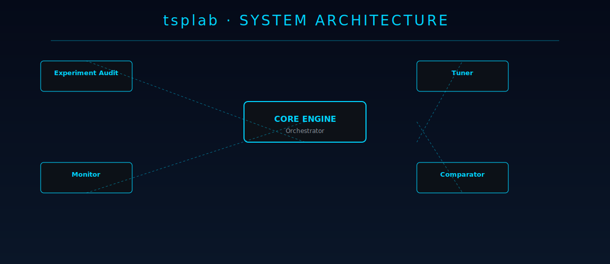

<div align="center">



</div>

## Forecasting Experiment Command Center

[](https://python.org/)
[](LICENSE)
[](https://github.com/disdorqin/tsplab/stargazers)
[](https://github.com/disdorqin/tsplab)
[](https://github.com/disdorqin/tsplab)

---

> TSPLab (Time Series Prediction Lab) is a command center for forecasting experiment management. Audit, monitor, tune, and compare time series forecasting experiments — with built-in support for NSE optimization and power market use cases.

## Why TSPLab Exists

Forecasting experiments are hard to track: which hyperparameters were used? How does this model compare to last week's? Is the experiment reproducible? TSPLab gives you a structured way to audit, monitor, tune, and compare forecasting experiments.

## Features

- **Experiment Audit** — structured logging of all experiment parameters and results  
- **Monitor** — real-time tracking of experiment progress and metric convergence  
- **Tuner** — hyperparameter optimization with experiment comparison  
- **Comparator** — side-by-side model comparison with NSE/MAE/R2 metrics  
- **Reproducibility** — every experiment is fully parameterized and replayable  
- **Power Market Ready** — built-in support for electricity price forecasting benchmarks  

## Architecture

<div align="center">
  
</div>

## Quick Start

```bash
# Clone and install
git clone https://github.com/disdorqin/tsplab.git
cd tsplab
pip install -e ".[dev]"

# Run an experiment
python -m tsplab experiment run --config examples/lstm_electricity.yaml

# Compare experiments
python -m tsplab compare --exp1 runs/001 --exp2 runs/002

# Launch monitor dashboard
python -m tsplab monitor --port 8080
```

## Example: Experiment Config

```yaml
# examples/lstm_electricity.yaml
model: LSTM
data: electricity_price.csv
features:
  - lag_24
  - lag_168
  - day_of_week
  - temperature
hyperparams:
  hidden_size: 64
  num_layers: 2
  learning_rate: 0.001
  epochs: 100
metrics:
  - NSE
  - MAE
  - R2
output: runs/lstm_v1
```

## Roadmap

- [x] Experiment audit logging
- [x] Basic monitor
- [ ] Hyperparameter tuner
- [ ] Experiment comparator dashboard
- [ ] Integration with DARIS for automated experiment pipelines
- [ ] Cloud experiment tracking

## Tech Stack

Python · pandas · numpy · PyTorch · scikit-learn · YAML

## Star History

[](https://star-history.com/#disdorqin/tsplab&Date)

## Contributing

See [CONTRIBUTING.md](CONTRIBUTING.md).

## License

MIT — see [LICENSE](LICENSE).
